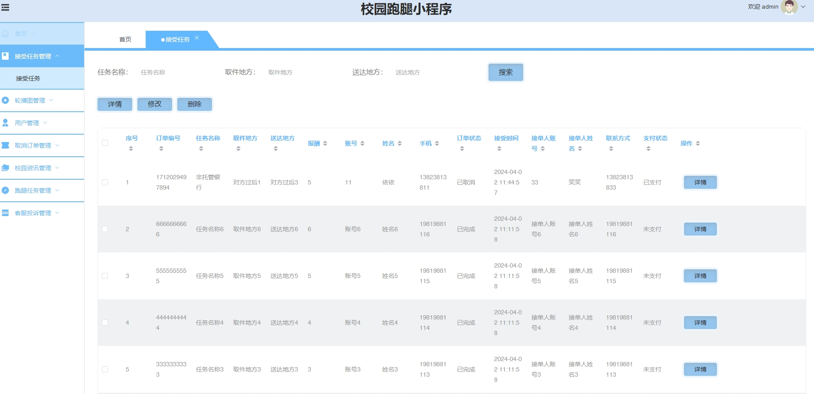
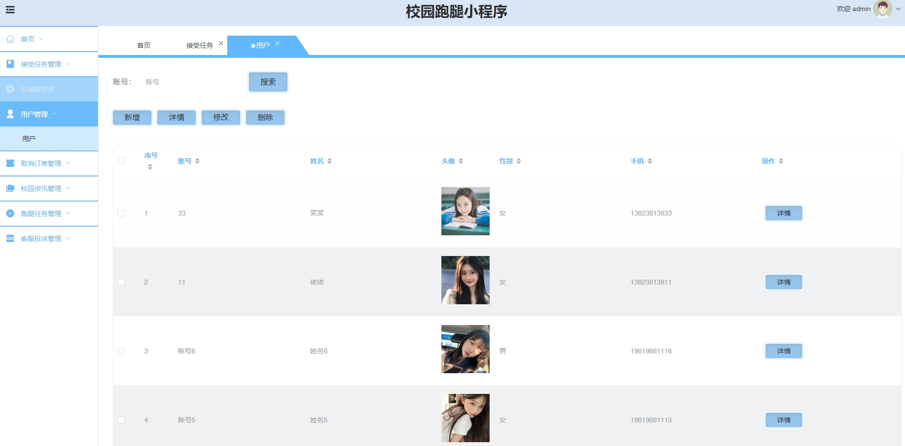
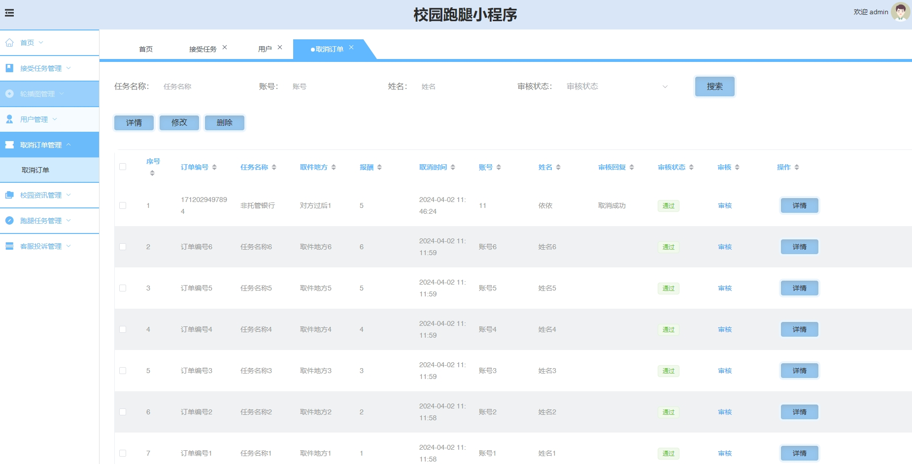
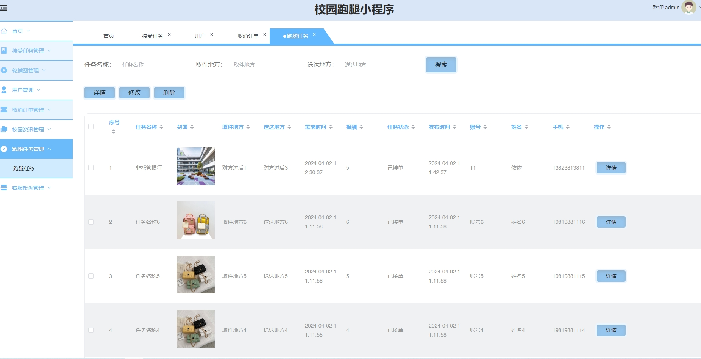
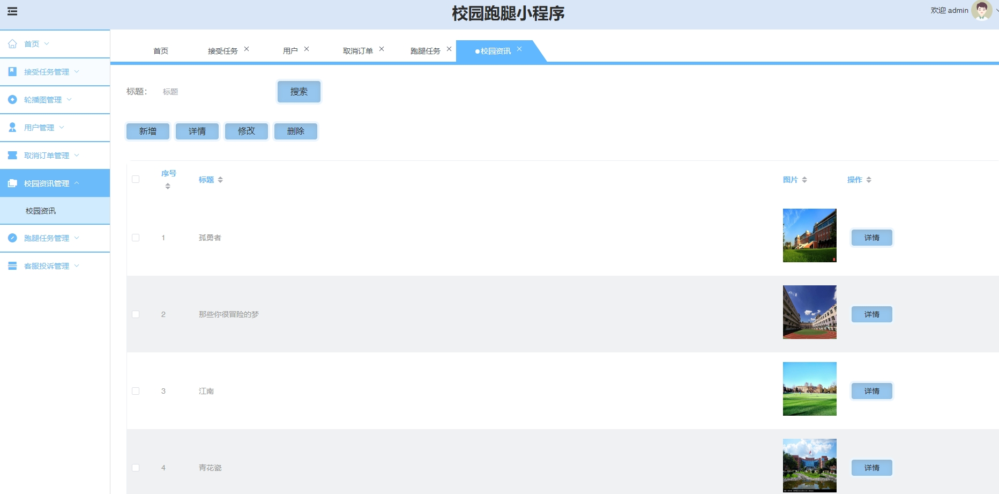
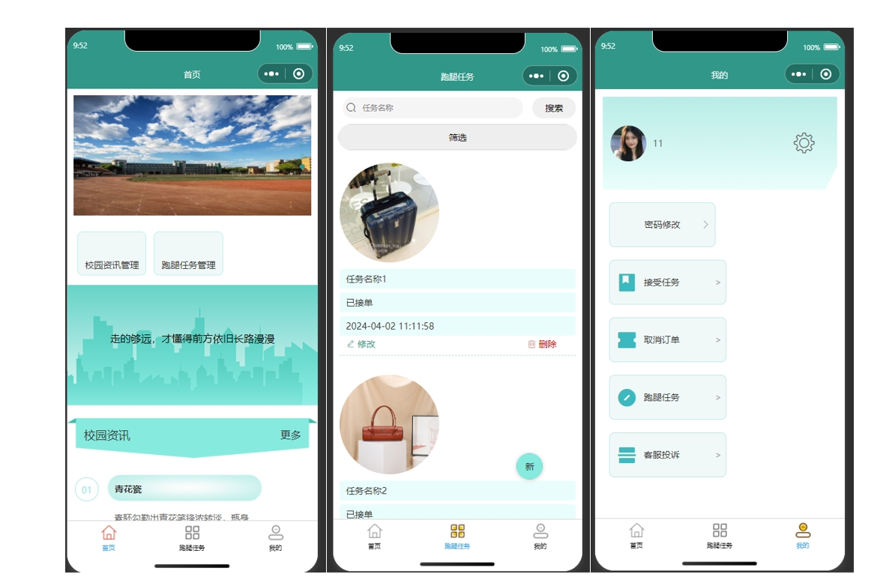
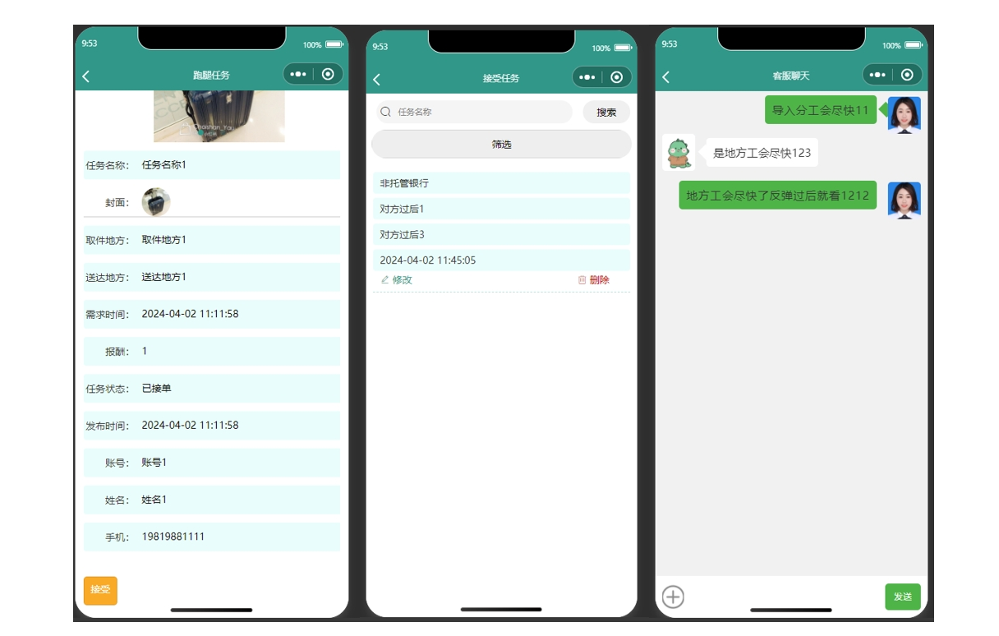

# 1.项目介绍
- 系统角色：管理员、普通用户
- 功能模块：用户管理、跑腿任务管理、订单管理、取消任务管理、校园咨询、客服咨询等
- 技术选型：SpringBoot，Vue（后端管理web），微信原生小程序等
- 测试环境：idea2024，jdk1.8，mysql5.7，maven3，Node14.16.1，微信开发工具
# 2.项目部署
## 2.1 后端部署
- 创建数据库，导入sql文件
- idea打开目录server_code，根据本地数据库环境修改src/main/resources/application.yml 12-15行
- 启动项目 src/main/java/com/cl/SpringbootSchemaApplication.java
## 2.2 管理web
- idea（安装vue.js插件）或者webstorm、vscode等ide工具打开项目manage_code
- 进入终端，输入 npm  install安装依赖（下载失败自行配置阿里的镜像加速）
- 启动项目 npm run serve
- 打开终端的地址，输入账号密码：admin、admin
## 2.3小程序部署
- 通过微信开发工具，打开项目wechat_code
- appid配置为你自己小程序的，或者你自己申请的测试小程序appid
- 信任项目即可，如果页面空白，重新编译下
# 3.项目部分截图

# 4.获取方式
[戳我查看](https://gitee.com/aven999/mall)
